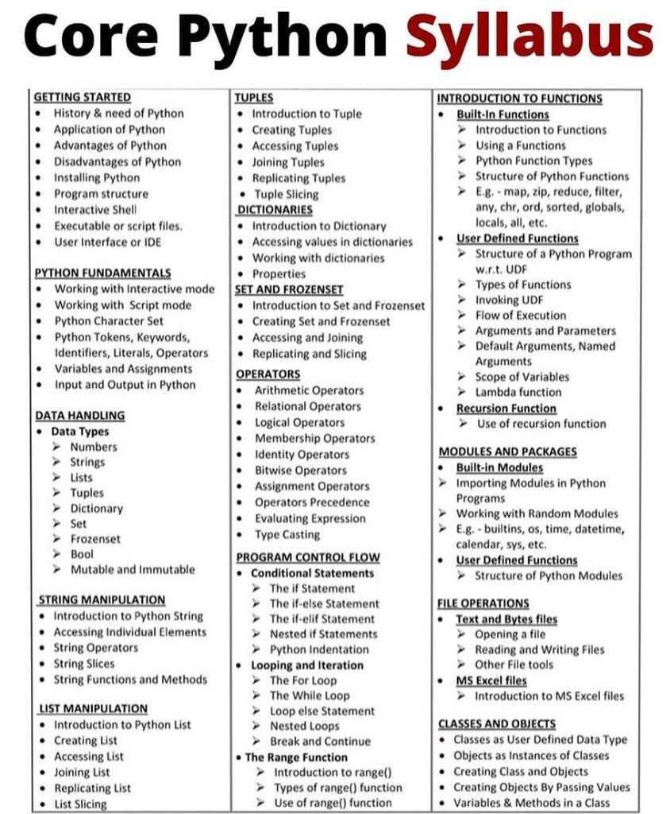

<h1 align="center">Fundamentals of Python Programming in Dentistry</h1>
<h3 align="center">From Dentists to Dentists
  <!-- https://www.markdownguide.org/basic-syntax/#images-1 -->
  <!--  
  
  
  -->
</h3>

<h4>Authors:</h4>
<h4> Dr. Igor Alves
  
</h4>
<h4> Dr. Gustavo Raime
  
</h4>
<h4> Vinícius Henrique - Graduando/USP
  
</h4>

<!-- https://divtable.com/generator/ -->
<!-- https://www.quackit.com/html/html_table_generator.cfm -->

  <table>
    <tbody>
      <tr>
        <td>
          <figure>
            
            <!--  <figcaption>SHP Bahia - Nazaré em Foco</figcaption> -->
          </figure>
        </td>
      </tr>
    </tbody>
  </table>

# Core Python Syllabus Course
- Prerequisite
  - GitHub
    - [QuickStart](https://docs.github.com/pt/get-started/quickstart/hello-world)   
    - [GitHub APP](https://desktop.github.com/)   
    - [GitKraken](https://www.gitkraken.com/)  
    - [GitLens — Git supercharged](https://marketplace.visualstudio.com/items?itemName=eamodio.gitlens)
    - [Git History Diff](https://marketplace.visualstudio.com/items?itemName=huizhou.githd)
    - [Git Graph](https://marketplace.visualstudio.com/items?itemName=mhutchie.git-graph)
    - [Git History](https://marketplace.visualstudio.com/items?itemName=donjayamanne.githistory)
    - [Git Blame](https://marketplace.visualstudio.com/items?itemName=waderyan.gitblame)
    - [Git Project Manager](https://marketplace.visualstudio.com/items?itemName=felipecaputo.git-project-manager)
    - [GitHub Theme](https://marketplace.visualstudio.com/items?itemName=GitHub.github-vscode-theme)
  - Gist 
  - VSCODE - Script Mode (Module 2) **
- Getting Started
  - Hystory and Need of Python
  - Application fo Python
  - Advantages of Python
  - Disadvantages of Python
  - Installing Pyhton
  - Program Structure
  - Interactive Shell *
  - Executable or Scripts Files (Module 2) **
  - User Interface or IDE
- Python Fundamentals
  - Working with Interactive Mode *
  - Working with Script Mode (Module 2) **
  - Working with Google-COLAB
  - Python Character Set *
  - Python Tokens, Keywords, Identifiers, Literals, Operators
  - Variables and Assignements
  - Input and Output in Python
- Data Handling
  - Data Types
    - Numbers
    - Strings
    - Lists
    - Tuples
    - Dictionary
    - Set
    - Frozenset
    - Bool
    - Mutable and Immutable  
- String Manipulation
  - Introdution to Python String
  - Accessing Individual Elements
  - String Operators
  - String Slices
  - String Function and Methods 
- List Manipulation
  - Introduction to Python List
  - Creating a List 
  - Assessing a List
  - Joining List
  - Replicating List
  - List Slicing 
- Tuples
  - Introduction to Tuples
  - Creating Tuples
  - Assessing Tuples
  - Joining Tuples
  - Replicating Tuples
  - Tuples Slicing 
- Dictionaries
- Set and Frozenset
- Operators
- Program Control Flow
- Introduction to Functions
  - Built in Functions
  - User Defined Functions
  - Recussion Functions *
- Modules and Packages
  - Built in Modules
  - User Defined Modules
- File Operations
- Classes and Objects *  

# Awesome Python Course 
> A curated list of awesome Python Classes!

## Tools

- [Python](https://www.python.org/) - A programming language
- [Google Colab](https://colab.research.google.com/?hl=pt-BR#create=true) - Code without install anything !
- [Anaconda](https://www.anaconda.com/) - The World's Most Popular Data Science Platform

## License

To the extent possible under law, [Matias Singers](https://mts.io) has waived all copyright and related or neighboring rights to this work.

## References
- [w3school](https://www.w3schools.com/python/)

- [Tutorial's Point](https://www.tutorialspoint.com/python/index.htm)

- [How to think like a computer scientist](https://openbookproject.net/thinkcs/python/english3e/)
- [Python Exercises, Practice, Solution](https://www.w3resource.com/python-exercises/)
- [Python Exercises, Practice Questions and Solutions](https://www.geeksforgeeks.org/python-exercises-practice-questions-and-solutions/)
- [Algorithms GEEKS4GEEKS](https://www.geeksforgeeks.org/algorithms-gq/)
