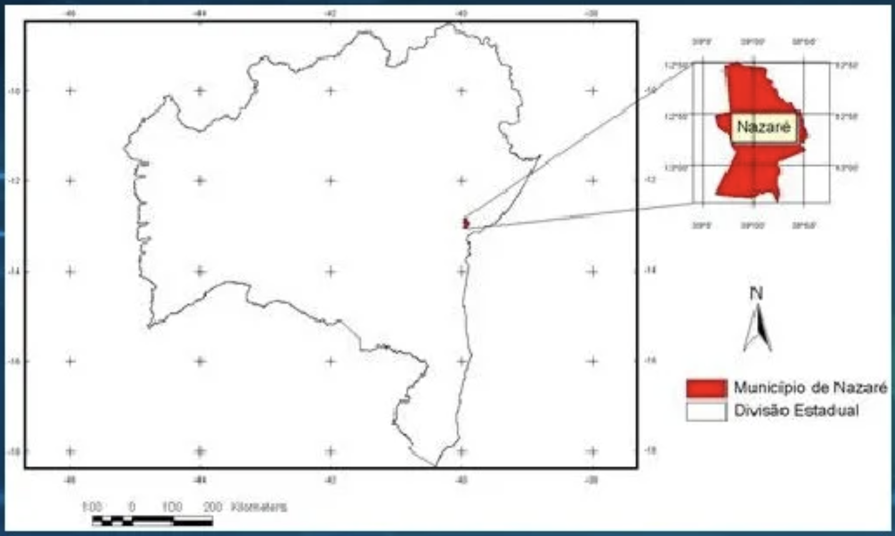
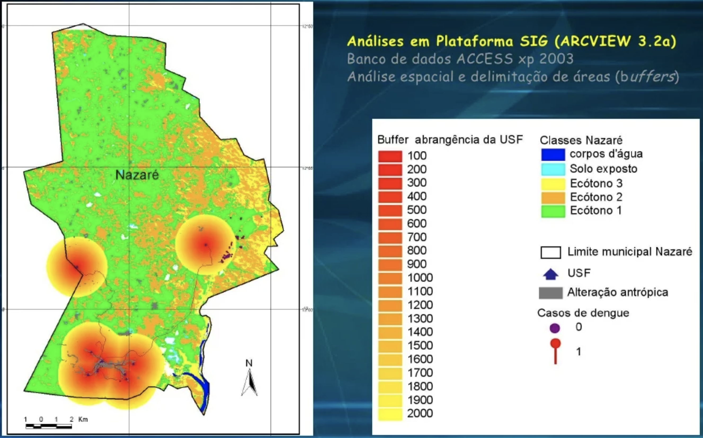

<h1 align="center">Sala de Situação em Saúde - SUS, Brasil</h1>
<h3 align="center">Dr. Igor Alves
<!-- https://www.markdownguide.org/basic-syntax/#images-1 -->
<!--  

-->
</h2>

  <table>
    <tbody>
      <tr>
        <td>
          <figure>
            
            <!--  <figcaption>SHP Bahia - Nazaré em Foco</figcaption> -->
          </figure>
        </td>
        <td>
          <figure>
            
            <!--  <figcaption>SHP Bahia - Nazaré em Foco</figcaption> -->
          </figure>
        </td>
      </tr>
    </tbody>
  </table>

A sala de situação em saúde, por natureza, tem o propósito de oferecer ferramentas (dados, informaçãoes e estruturas) para que os atores envolvidos no processo saúde-doença (gestores, coordenadores e executores e possivelmente pacientes, entre outros) tomem decições mais acertivas sobre os sistemas de saúde em momentos de crise, quando e onde o acesso a informação é precário, reduzido e extremamente necessário. Essas informações são usadas na tomada de decisões e também no acompanhamento e avalaição das ações escolhidas além do controle do próprio processo de geração de informação em si.

O entendimento do 'REAL' cenário - ou próximo do real, da situação de saúde de uma determinada população num detrminado local e determinado tempo, passado, presente ou futuro, depende da disponibilidade de informações confiáveis, acessíveis e reproduzíveis. O entendimento e/ou a interpretação da situação de saúde é o fator que antecede a tomada de decisão. 

A Sala de Situacao em Saúde fora os momentos de crise é uma poderosa ferramenta para a gestão e monitoramento dos Sistemas de Saúde a nível local, municipal, estadual ou federal. 

De forma geral, podemos dividir o processo operacional de uma 'Sala de Situação em Saúde' em 3 etapas: A GERAÇÂO dos DADOS, O ARMAZENAMENTO E PROCESSAMENTO dos DADOS e a PUBLICAÇÂO ou EXIBIÇÂO DAS INFORMAÇÔES para os atores envolvidos no processo. Note a diferença entre dado e informação empregada nessa frase. Os dados precisam ser tratados e analisados antes de se transformarem em informações que podem ser utilizadas por diferentes atores em diferentes situações e momentos.

# 1-DA GERAÇÂO/ALIMENTAÇÃO dos DADOS

Essa fase faz referência aos processos que estão envolvidos na geração dos dados e que de maneira direta ou indreta representam a situação de saúde numa população espaço e tempo. Uma pessoa, saudável ou doente para poder existir aos olhos de uma equipe de GESTÂO DE SAÚDE precisa em primeiro lugar, notificar, informar sobre o seu estado para essa equipe. Note que, por conclusão, por mais que tenhamos um sistema de informação altamente sensível, a captura do estado de saúde REAL de uma população ou indivíduo é muito difícil ou quase impossível. Por isso trabalha-se com um grande quantitativo de indicadores para poder ser aproximar do real cenário o mais que possível.
A escolha de indicadores deve ser feita de maneira cosnciente e cautelosa. Uma escolha de indicadores feita de maneira descontrolada leva a uma sobrecarga da sala de situação podendo desviar o foco de daods mais importantes. A nível tecnológico, a escolha indiscriminada de indicadores conduz um sistema superestimado, sobrecarregado que leva mais tempo para ser desenvolvido e mantido com custos operacionais mais elevados de transmissão e armaenamento de dados. Haverá também custos associados aos processamentos de dados que poderiam ser evitados, levando-se em consideração da criação de uma arquitetura que opera em nuvens computacionais - PAY PER USE.

> Nota: Importantíssimo lembrar que um SISTEMA DE INFORMÁTICA (QUALQUER QUE SEJA) CRIADO A PARTIR DE UM PROCESSO POUCO ANALISADO TERÁ UM CUSTO DE DESENVOLVIMENTO E OPERACIONAL DESNECESSARIAMNTE MAIS ALTO, BEM COMO UMA EXPECTATIVA DE VIDA MAIS REDUZIDA COM GRANDES PROBABILIDADES DE REFATORAÇÃO A CURTO PRAZO. O desenvolvimento de um sistema de informação de uma Sala de Situacao em Saúde traz muitos desafios não somente pela complexidade envolvendo a parte tecnológica como a criação do software em si (tecnologias, arquitetura, liguagens de programação, armazenamento e processamento dos dados entre outros) mas também toda a parte gerencial de desenvolvimento do software que antecede a execução desse processo e que envolve atores com diferentes profissões e pontos de vistas a respeito dos processos de saúde ou do próprio sistema de saúde. Esta fase tem que ser gerenciada por um PM (Project Manager) que, de preferência, entenda os processos dos dois mundos envolvidos neste esforço - a Saúde e a Tecnologia ou Informática e Saúde. Mais uma vez é válido notar que se esse critério não for obedecido, tem-se uma alta probabilidade de que se tenha como produto final um sistema de informação de alto custo e com desempenho muito aquem do esperado, possuindo como reflexo, uma baixa adesão de uso.

## Determinação de Indicadores a Serem Acompanhados pela Sala de Situação em Saúde do SUS

A percepção da importância e escolha dos indicadores para o elenco a serer usados em um projeto sala de situação varia com o tempo e é dinâmico, ou seja, indicadores escolhidos pelo time poderão ser alterados a medida que o processo evolui. A medida que o próprio sistema de saúde evolui e/ou a percepção por parte dos atores nele envolvidos também evolui, alguns indicadores antes considerados necessários, não o serão mais, podendo e devendo assim ser eliminados, e outros que antes não faziam parte do elenco poderão e deverão ser incluídos.

- A escolha dos indicadores devem ser extensiva e continuamente acordada pelo(s) PO/PM do projeto. 
- Nas reuinões de do time envolvidos no processo ANTES dos meetings com a equipe de Eng de Software.
- Cada indicador deve ser acompnahado com detalhes do seu processo de construção. Texto descritivo sobre o NUMERADOR, DENOMINADOR e FATOR de MULTIPLICAÇÂO, caso necessário.
- Cada indicador deve conter:
  - Fontes, Origem dos dados:
    - Fonte primária, secundaria?
      - Sistemas de Informação oficiais usados como fonte secundária
      - Processos, atores, contatos ou lugares envolvidos nos indicadores de fonte primária 
      - Taxa de atualização
- Escolha de indicadores para serem avaliados em REAL-TIME ou não REAL_TIME.
- Indicadores do Modelo EGIPSS:

- Indicadores De 

- A quantidade e frequencia com que os dados serão injetados no sistema e a sua utilização irão guiar ou definir a arquitetura do dataware house ou do data lake do sistema. 

# 2-DA ARMAZENAGEM e PROCESSAMENTO do DADOS

- Uso de cloud computing (AWS) ?

- Mobile ?
- BackEnd de moderna arquitetura de softwares com ênfase em microserviços e serverless com lâmbdas para garantir baixo custo. 
- Segurança de dados e dsiponibilidade de regiões. 
- Data lakes preparados para processos real-time.

# 3-DA EXIBIÇÂO do DADOS
- Front-end ou micro front-end descentralizados seguindo o paradigma de sistemas desacoplados com microserviços consumindo RESTful endpoints. WebSockts para exibição real-time de dados.

## Lista de Indicadores a Serem Acompanhadas pela Sala de Situação em Saúde do SUS
- Influenza Surveillance Report (H3N2)

# References
1. [UNAIDS PROJECT 2018-2020 COUNTRY HEALTH SITUATION ROOM](https://situationroom.unaids.org/)
2. [GIS and Public Health at CDC](https://www.cdc.gov/gis/index.htm)
3. [Weekly U.S. Influenza Surveillance Report](https://www.cdc.gov/flu/weekly/index.htm)
4. [Situation Room Health](https://ivedix.com/solutions/situation-room/)
5. [Situation Room](https://smallbusinessatwork.org/tool/5/situationroom)
6. [A Local Health Situation Room for COVID-19: Recommendations for Decision-Making From a Higher Education Institution in Mexico](https://www.frontiersin.org/articles/10.3389/fpubh.2021.735658/full)
7. [NCBI-A Local Health Situation Room for COVID-19: Recommendations for Decision-Making From a Higher Education Institution in Mexico](https://www.ncbi.nlm.nih.gov/pmc/articles/PMC8573138/)
8. [IBM Cognos Analytics with Watson](https://www.ibm.com/products/cognos-analytics)
9. 
10. 
11. 
12. 
13. 
14. 
15. 

<!-- MARKDOWN LINKS & IMAGES -->

